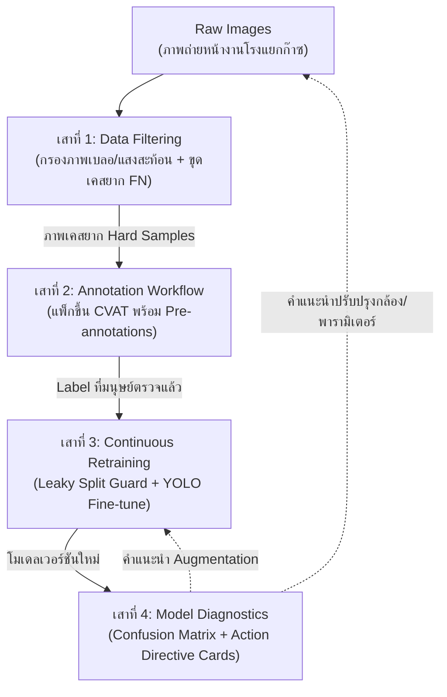

# 📘 PTT Smart AI Platform: Handover & Study Guide
### คู่มือการศึกษาและส่งมอบระบบ สำหรับวิศวกร AI / MLOps คนใหม่

> **ไฟล์เอกสาร**: `/home/luke/ai_training/PTT_ai_mini/docs/about_project.md`  
> **โปรเจกต์หลัก**: `PTT Smart AI Platform` (ระบบตรวจจับอุปกรณ์และวิเคราะห์ความปลอดภัยในโรงแยกก๊าซธรรมชาติ ปตท.)  
> **เวอร์ชันเอกสาร**: 1.0.0 (Handover Edition)  
> **สถานะการพัฒนา**: Option A Strangler Fig (FiftyOne-Native + YOLO12 Pipeline)

---

## 🎯 1. พันธกิจของระบบและทิศทางจากหัวหน้างาน (Project Mission & Core Mandate)

ยินดีต้อนรับสู่งานพัฒนา **PTT Smart AI Platform**! เอกสารฉบับนี้ถูกออกแบบมาเพื่อให้คุณสามารถเข้าใจภาพรวมทั้งหมด สถาปัตยกรรม และเริ่มลงมือทำงานต่อได้ทันทีภายใน 1-2 วัน โดยไม่ต้องเสียเวลางมโค้ด

### 🚨 ทิศทางสำคัญที่สุดจากหัวหน้างาน (The Boss's Directive):
> *"อย่าเสียเวลาไปกับเรื่อง Fullstack Web UI, Frontend, หรือฐานข้อมูล CRUD ทั่วไป เพราะส่วนนั้นมีทีมอื่นดูแลอยู่แล้ว... **ขอให้โฟกัส 100% ที่เครื่องมือ AI Pipeline: ตั้งแต่กระบวนการกรองข้อมูล (Filter), การจัดการติดป้ายกำกับ (Annotation/CVAT), การเทรนซ้ำอัตโนมัติ (Retrain), และระบบวิเคราะห์ผลเพื่อออกคำแนะนำเชิงวิศวกรรม (Diagnostics & Action Directives)**"*

---

## 🏗️ 2. เสาหลักทั้ง 4 ของระบบ (The 4 Engineering Pillars)

ระบบนี้ไม่ได้เป็นเพียงแค่สคริปต์เทรนโมเดล YOLO ธรรมดา แต่เป็น **End-to-End Active Learning & Data-Centric Platform** ที่รองรับอุปกรณ์ในโรงแยกก๊าซ ปตท. ทั้งหมด **26 คลาส** (เช่น `handwheel-valve`, `control-valve`, `flange`, `analog-gauge`, `flow-line` ฯลฯ)



---

### เสาที่ 1: Data Quality Filtering & Hard Sample Mining (การคัดกรองข้อมูล)
การป้อนภาพที่ไม่ดีเข้าโมเดล จะทำให้ AI ตอบผิด (Garbage in, Garbage out) ระบบจึงมีกระบวนการกรอง 2 ชั้น:
1. **คัดกรองกายภาพ (Optical Quality)**:
   * **ตรวจจับภาพเบลอ (Motion Blur)**: คำนวณ *Variance of Laplacian* ถ้าต่ำกว่า 120 ถือว่าเบลอ (กล้องสั่น/เลนส์มัว)
   * **ตรวจจับแสงสะท้อนจ้า (Specular Metallic Glare)**: คำนวณสัดส่วนพิกเซลที่ Value สูง ($V > 240$) และ Saturation ต่ำ ($S < 40$) บนท่อโลหะ ถ้าเกิน 15% ถือว่าแสงสะท้อนทำลายรายละเอียด
2. **ขุดหาเคสยาก (Hard Sample Mining)**:
   * **False Negatives (หลุดรอดสายตา - วิกฤตสุด)**: วัตถุของจริงมีอยู่ในภาพ (Ground Truth) แต่โมเดลไม่มีกล่องทับ ($IoU < 0.5$)
   * **Ambiguous Confidence**: AI ตรวจเจอ แต่ความมั่นใจก้ำกึ่ง ($0.25 \le \text{Conf} \le 0.65$)
   * **Deduplication**: ตัดภาพที่ช่างหน้างานรัวชัตเตอร์ซ้ำมุมเดิม ($\ge 90\%$ Cosine Similarity)

---

### เสาที่ 2: Annotation Workflow & CVAT Integration (วงจรการตรวจแก้ข้อมูล)
* **ปัญหาจริง**: การจ้างช่างมานั่งวาดกล่องใน CVAT ทุกภาพมีค่าใช้จ่ายสูงและเสียเวลามาก
* **วิธีแก้ของระบบ**: 
  * ส่งเฉพาะ **"ภาพเคสยาก (Hard Samples)"** ที่ผ่านการคัดเลือกจากเสาที่ 1 ขึ้นไปทำใน CVAT เท่านั้น
  * แนบ **Pre-annotations (กล่องที่ AI พอเดาได้)** ขึ้นไปด้วย คนวาดไม่ต้องเริ่มจากศูนย์ แค่แก้กล่องสีแดง (จุดที่หลุด) ช่วยลดเวลาทำงานของคนไปได้ถึง **70-80%**

---

### เสาที่ 3: Continuous Retraining Pipeline (การเทรนซ้ำอย่างปลอดภัย)
* **Automated Trigger**: ตรวจสอบเงื่อนไขว่า Hard Samples ที่ผ่านการรีวิวมีจำนวนครบเกณฑ์ขั้นต่ำหรือไม่
* **Leaky Split Guard (เกราะป้องกันข้อสอบรั่ว - กฎเหล็ก)**:
  * ระบบจะตรวจสอบชื่อไฟล์และ Hash กับชุด `test` และ `valid` Benchmark หลัก
  * หากพบว่ามีภาพจากชุด Test Set ปะปนเข้ามาในบัฟเฟอร์ ระบบจะ **บล็อกและคัดทิ้งทันที** เพื่อป้องกันโมเดลจำข้อสอบ (Data Leakage)
* **Fine-Tuning Strategies**: เทรนต่อด้วย Learning Rate ต่ำ ($lr_0 = 0.001$) และเปิดใช้ `copy_paste=0.3` เพื่อสังเคราะห์คลาสหายาก

---

### เสาที่ 4: Model Diagnostics & Action Directives (การวิเคราะห์และออกคำสั่งปฏิบัติการ)
หัวหน้าไม่ต้องการเห็นแค่ตัวเลขกราฟ mAP รวมลอยๆ แต่ต้องการ **"คำแนะนำระดับวิศวกรที่นำไปทำต่อได้ทันที (Actionable Recommendations)"**
* **Per-Class Failure Profiler**: เจาะลึกว่าอุปกรณ์ใดที่ AI มีปัญหามากที่สุด (เช่น `flange` หน้าแปลน, `small-valve` วาล์วจิ๋ว)
* **Directive Rules Engine**: แปลงผลทางสถิติออกมาเป็นการ์ดคำสั่งปฏิบัติการ (**Action Directive Cards**):
  * **🏷️ DIR-001 (SAHI)**: สำหรับวาล์วขนาดเล็กระยะไกล ให้เปิดโหมด Slicing (512x512) ตอน Inference ดึง Recall เพิ่ม 15-25% ทันทีโดยไม่ต้องเทรนใหม่
  * **🏷️ DIR-002 (Copy-Paste)**: สำหรับคลาสหน้าแปลนที่มีความสับสนสูง ให้ตัดชิ้นส่วนไปแปะสุ่มบนฉากอื่นๆ ก่อนเทรนรอบถัดไป
  * **🏷️ DIR-003 (Sensor Maintenance)**: หากพบเลนส์กล้องเบลอสะสม ให้แจ้งทีมซ่อมบำรุงหน้างานไปเช็ดหน้าเลนส์หรือติดฟิลเตอร์ CPL (Polarizer)

---

## 🧪 3. แหล่งเรียนรู้แบบปฏิบัติจริง: Mini-Labs Sandbox

สำหรับวิศวกรใหม่ ให้เริ่มศึกษาจากห้องทดลองขนาดเล็กที่เขียนไว้แบบ Self-contained ในโฟลเดอร์:  
📂 `/home/luke/ai_training/PTT_ai_mini/`

| สคริปต์ Mini-Lab | เสาหลัก | รายละเอียดสิ่งที่ทำในโค้ด | คำสั่งทดสอบรัน |
| :--- | :---: | :--- | :--- |
| **`filter_module/lab_a_blur_glare.py`** | เสาที่ 1 | คำนวณค่าความคมชัด Laplacian Variance และคำนวณแสงสะท้อน HSV Mask บนภาพจริง ปตท. | `python filter_module/lab_a_blur_glare.py` |
| **`filter_module/lab_b_dedup_uniqueness.py`** | เสาที่ 1 | สกัดเวกเตอร์ 576 มิติ (MobileNetV3) หาภาพถ่ายรัวซ้ำมุมเดิม ($\ge 90\%$) และจัดลำดับความแปลก (Uniqueness) จาก 25 ภาพจริง | `python filter_module/lab_b_dedup_uniqueness.py` |
| **`filter_module/lab_c_hard_samples.py`** | เสาที่ 1 & 2 | รัน YOLO จริงเทียบกับ Ground Truth หาภาพที่มี False Negatives แล้วสร้างไฟล์ `cvat_tasks_manifest.json` พร้อมภาพวาดเปรียบเทียบ `lab_c_hard_sample_visualized.jpg` | `python filter_module/lab_c_hard_samples.py` |
| **`filter_module/lab_d_retrain_and_diagnostics.py`** | เสาที่ 3 & 4 | จำลอง Leaky Split Guard สกัดภาพ Test Set ทิ้ง, คำนวณ Hyperparameters เทรนซ้ำ, และรัน Rules Engine สร้างการ์ด Action Cards ออกมาเป็น `diagnostic_action_report.json` | `python filter_module/lab_d_retrain_and_diagnostics.py` |
| **`filter_module/lab01_review_state.py`** | เสาที่ 2 | จำลองตาราง `hard_sample_reviews` ด้วย SQLAlchemy/SQLite — state machine `pending → approved/rejected` → ดึงเฉพาะ approved ส่ง CVAT | `python filter_module/lab01_review_state.py` |
| **`fiftyone_module/lab_fiftyone_curation.py`** | ทั้งระบบ | ตัวอย่างการผสาน Built-in Methods ของ FiftyOne ร่วมกับ Custom OpenCV Enriched Fields | `python fiftyone_module/lab_fiftyone_curation.py` |
| **`docker/`** (Docker Compose) | ทั้งระบบ (FiftyOne) | mongo + FiftyOne 1.21 + App :5151 + เทส 12 ไฟล์ครอบคลุมเครื่องมือ FiftyOne ทีละตัว (dedup, similarity, uniqueness, hardness, mistakenness, evaluate_detections, visualization, export/CVAT) | `cd docker && cp .env.example .env && docker compose up -d --build` → `docker/scripts/run-tests.sh` |

> **ชุดข้อมูล + โมเดล อยู่ในตัว repo แล้ว** — `datasets/active_learning_split/{seed,pool}_dataset` (โครง YOLO + `data.yaml` 26 คลาส) และ `models/PTT_YOLO12n_v11i_Baseline_v1.0.0_best.pt`
> ทั้ง `datasets/` + `models/` gitignore ไว้ (ใหญ่) → หลัง clone รัน **`scripts/setup-assets.sh`** ครั้งเดียว (hardlink จาก repo ต้นทาง, ~0 bytes)
> ทุก lab อ่าน path จาก env `PTT_DATASET_DIR` / `PTT_MODEL_PATH` (มี default ชี้ในตัว repo) — **ไม่พึ่ง `PTT_smart_ai_platform` ตอนรันแล้ว**

---

## 🗺️ 4. แผนผังโครงสร้างซอร์สโค้ดในระบบจริง (`PTT_smart_ai_platform`)

เมื่อเข้าใจ Mini-Labs แล้ว นี่คือตำแหน่งไฟล์จริงใน Core Repository ที่คุณต้องเข้าไปดูแลต่อ:

```text
/home/luke/ai_training/PTT_smart_ai_platform/
├── models/
│   └── PTT_YOLO12n_v11i_Baseline_v1.0.0_best.pt    # โมเดลน้ำหนักจริง (26 คลาส)
├── datasets/
│   └── overall-ptt-object-detection.v11i.yolov11/   # ชุดข้อมูลหลัก (train/valid/test)
├── src/ptt_diagnostics/
│   ├── platform_core/
│   │   ├── config_manager.py       # รายชื่อ 26 คลาสอุปกรณ์ ปตท. และ Path ต่างๆ
│   │   └── model_loader.py         # ตัวโหลดโมเดลรองรับทั้ง PyTorch (.pt) และ ONNX
│   ├── data_filter/                # [เสาที่ 1 & 2] โฟลเดอร์ระบบคัดกรองข้อมูล
│   │   ├── filter_stage1_blur_glare.py     # ตัวกรองเบลอและแสงสะท้อน
│   │   ├── filter_stage2_confidence.py     # ตัวขุด False Negatives และ Ambiguity
│   │   ├── filter_stage5_diversity.py      # FiftyOne Brain Similarity & Deduplication
│   │   ├── fiftyone_enricher.py            # ตัวฝังค่า Custom metrics ลง FiftyOne Samples
│   │   └── hard_sample_review.py           # State Machine จัดการสถานะการรีวิว
│   ├── mlops_integration/          # [เสาที่ 3] โฟลเดอร์ระบบ Retraining
│   │   ├── pipeline_trigger.py     # ตัวควบคุม Subprocess รัน train_yolo.py
│   │   └── copy_paste_augmentor.py # ตัวสังเคราะห์ภาพชิ้นส่วนวาล์วหายาก
│   └── active_diagnostics/         # [เสาที่ 4] โฟลเดอร์ระบบออกคำแนะนำ
│       ├── directive_rules_engine.py       # เครื่องยนต์สร้างการ์ดคำสั่งปฏิบัติการ
│       └── diagnostics_hub.py              # ตัวรวมสัญญาณความผิดปกติทุกโมดูล
```

### 4.1 โครงสร้าง repo นี้ (`PTT_ai_mini`) ตอนนี้

```text
/home/luke/ai_training/PTT_ai_mini/
├── CLAUDE.md / AGENTS.md            # บริบทโปรเจกต์ (อ่านก่อนเริ่ม)
├── .claude/agents/                  # subagents: pillar-filter, pillar-diagnostics, lab-verifier
├── docs/
│   ├── about_project.md             # ไฟล์นี้
│   └── implementation_checklist.md  # checklist เตรียม implement 4 เสา
├── scripts/setup-assets.sh          # ดึง datasets/ + models/ เข้า repo (ครั้งเดียวหลัง clone)
├── datasets/                        # (gitignored) — ชุดข้อมูลในตัว repo
│   ├── active_learning_split/
│   │   ├── seed_dataset/            # 1000 train + valid/test  (default ของ labs)
│   │   ├── pool_dataset/            # 2887 train + valid/test
│   │   └── split_manifest.json
│   └── overall-ptt-object-detection.v11i.yolov11/   # ไดเรกทอรีจริง (hardlink) ที่ symlink ด้านบนชี้หา
├── models/                          # (gitignored) — PTT_YOLO12n_v11i_Baseline_v1.0.0_best.pt
├── filter_module/                   # เสาที่ 1–4 (lab a–d + lab01) + README.md + ผลลัพธ์ตัวอย่าง .json
├── fiftyone_module/                 # lab + README + fiftyone_complete_guide_th.md
├── docker/                          # Docker Compose: mongo + FiftyOne + เทส 12 ไฟล์ + App :5151
│   ├── docker-compose.yml / Dockerfile / requirements.txt
│   ├── scripts/  (run-tests, run-lab, seed-demo, seed-eval-demo, launch-app)
│   └── tests/    (test_00..test_11 — เครื่องมือ FiftyOne ทีละตัว)
├── cvat_module/                     # (ว่าง) — ที่สำหรับงานเชื่อม CVAT เสาที่ 2
└── diagnostic_module/               # (ว่าง) — ที่สำหรับพอร์ต logic เสาที่ 4
```

---

## ⚙️ 5. สภาพแวดล้อมการทำงานและวิธีเริ่มต้นในวันแรก (Day 1 Quickstart)

### 5.1 Environment ที่ใช้งาน
* **Conda Environment**: `ai_training` (มี Python 3.12, PyTorch 2.5 + CUDA, Ultralytics, OpenCV, FiftyOne 1.21 ติดตั้งพร้อมใช้งาน)
* **เปิดใช้งาน**:
  ```bash
  conda activate ai_training
  ```
* **ชุดข้อมูล / โมเดล** — ครั้งแรกหลัง clone:
  ```bash
  bash scripts/setup-assets.sh        # ดึง datasets/ + models/ เข้ามาในตัว repo (hardlink, ~0 bytes)
  ```
  labs อ่าน path จาก env (มี default ในตัว repo — ตั้งเองได้ถ้าจะ override):
  ```bash
  export PTT_DATASET_DIR=/home/luke/ai_training/PTT_ai_mini/datasets/active_learning_split/seed_dataset   # หรือ .../pool_dataset
  export PTT_MODEL_PATH=/home/luke/ai_training/PTT_ai_mini/models/PTT_YOLO12n_v11i_Baseline_v1.0.0_best.pt
  ```
* **ทางเลือก Docker** (ไม่ต้องมี conda) สำหรับส่วน FiftyOne: `cd docker && cp .env.example .env && docker compose up -d --build` — ดู `docker/README.md`

### 5.2 ทดสอบความพร้อมของระบบ (Smoke Test)
รันคำสั่งนี้เพื่อเช็คว่าทั้ง GPU, YOLO และ FiftyOne ทำงานได้สมบูรณ์:
```bash
python -c "
import torch, cv2, fiftyone as fo, ultralytics
print('CUDA Ready:', torch.cuda.is_available())
print('FiftyOne Version:', fo.__version__)
print('OpenCV Version:', cv2.__version__)
print('Ultralytics Version:', ultralytics.__version__)
"
```

---

## 📋 6. รายการสิ่งที่ต้องทำต่อ (Next Action Items for Incoming Engineer)

1. **เชื่อมต่อ CVAT ให้สมบูรณ์ (End-to-End Test)**:
   * นำไฟล์ `cvat_tasks_manifest.json` จาก Lab C ไปทดสอบยิง API เข้า CVAT Server ผ่านฟังก์ชัน `dataset.annotate()` ของ FiftyOne
2. **ปรับเกณฑ์ Threshold ของ Rules Engine ให้เข้ากับหน้างานจริง**:
   * ตรวจสอบค่า `blur_threshold` (ปัจจุบันตั้งไว้ที่ 120) และ `glare_ratio` (15%) ว่าเหมาะสมกับสภาพแสงแดดช่วงเที่ยงของโรงแยกก๊าซจริงหรือไม่
3. **จัดเก็บรายงานคำแนะนำ (Action Cards) เข้าสู่ Dashboard**:
   * ส่งออกผลลัพธ์ของ `directive_rules_engine.py` ไปแสดงผลบนหน้าจอแดชบอร์ดเพื่อให้วิศวกรโรงงานเปิดอ่านได้ง่ายๆ

---

> **หมายเหตุถึงวิศวกรใหม่**: โค้ดทั้งหมดในระบบนี้ถูกออกแบบให้อ่านง่าย มี Type Hinting และ Docstring ชัดเจน หากมีข้อสงสัย ให้เริ่มไล่โค้ดจาก `PTT_ai_mini/` ก่อน แล้วค่อยขยายไปยัง `src/ptt_diagnostics/` ขอให้สนุกกับการพัฒนาต่อยอดระบบครับ! 🚀
