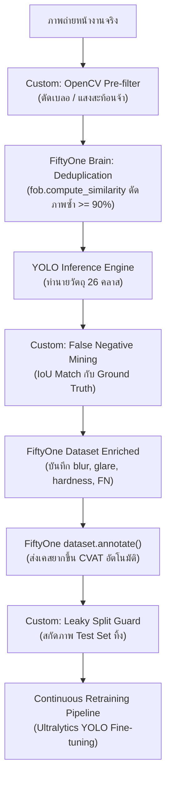

# 🧭 คู่มือ FiftyOne (Voxel51): ฟังก์ชันสำเร็จรูป vs ส่วนที่ต้องเขียนเพิ่มเองสำหรับงานอุตสาหกรรม

> **โฟลเดอร์**: `/home/luke/ai_training/PTT_ai_mini/fiftyone_module/`  
> เอกสารและชุดโค้ดนี้สรุปเปรียบเทียบระหว่าง **สิ่งที่ FiftyOne มีให้พร้อมใช้ทันที** กับ **สิ่งที่ระบบอุตสาหกรรมจริง (เช่น ปตท.) ต้องเขียน Custom เพิ่มเติม**

---

## 📊 1. ตารางเปรียบเทียบฟังก์ชันใน FiftyOne

| ความสามารถ (Capability) | สถานะ | ฟังก์ชันสำเร็จรูปใน FiftyOne | สิ่งที่ต้องเขียนเพิ่มเอง (Custom Implementation) |
| :--- | :---: | :--- | :--- |
| **ความคมชัด / คุณภาพภาพ (Image Quality)** | ⚠️ กึ่งสำเร็จ | `compute_metadata()` (ขนาด, resolution, mime-type) | ตรวจจับภาพเบลอ (Variance of Laplacian / FFT), วัดความสว่าง/Over-exposure (เขียน Loop คำนวณแล้วโยนเข้า `dataset.set_values()`) |
| **หาภาพซ้ำ (Deduplication)** | ✅ มีสำเร็จรูป | `fob.compute_exact_duplicates()`<br/>`fob.compute_similarity()` | กำหนด Logic ลบ/ย้ายไฟล์อัตโนมัติบนดิสก์จริงตามเงื่อนไขทางธุรกิจ (เช่น เก็บภาพแรก ลบภาพหลัง) |
| **ความหลากหลาย (Diversity Sampling)** | ✅ มีสำเร็จรูป | `fob.compute_similarity(..., metric="cosine")`<br/>`fob.compute_visualization()` (UMAP/t-SNE) | อัลกอริทึม Core-set Selection หรือ K-Medoids แบบเจาะจง (FiftyOne มี Similarity View ให้ Slice แต่ไม่มี `sample_diverse()` สำเร็จรูปในคลิกเดียว) |
| **หาความผิดปกติ / หลุดกลุ่ม (Outlier Detection)** | ✅ มีสำเร็จรูป | `fob.compute_hardness()`<br/>`fob.compute_similarity()` (หาตัวที่ distance ไกลเพื่อน) | ระบบ Thresholding อัตโนมัติสำหรับ Pipeline CI/CD บนโรงงาน |
| **ตรวจจับ Label ผิด (Label Errors)** | ✅ มีสำเร็จรูป | `fob.compute_mistakenness()` | กรณีต้องการใช้ Cleanlab backend จำเป็นต้องส่งค่า Probability Matrix ไปให้ Cleanlab คำนวณภายนอกแล้ว Import ค่าผลลัพธ์กลับเข้ามา |
| **Uncertainty Sampling (ความไม่แน่นอน)** | ❌ ต้องเขียนเพิ่ม | มี View Expression สำหรับ Query/Filter เช่น `dataset.filter_labels("predictions", F("confidence") < 0.5)` | การคำนวณ Shannon Entropy, Margin Sampling, หรือ Least Confidence จาก Softmax Distribution ของโมเดล |
| **เชื่อมต่อเครื่องมือ Annotation** | ✅ มีสำเร็จรูป | `dataset.annotate()` (เชื่อมกับ CVAT, Labelbox, Label Studio ได้ในคำสั่งเดียว) | Auto-assignment rules หรือ Trigger อัตโนมัติเมื่อเจอดาต้าตกเกณฑ์ |

---

## 🚀 2. ฟังก์ชันสำเร็จรูปที่เรียกใช้ได้ทันที (Built-in Methods)

### 2.1 หาภาพซ้ำ (Exact Duplicates & Near-Duplicates)
ใช้ FiftyOne Brain คำนวณความซ้ำซ้อนผ่าน Embedding หรือ Hashing:
```python
import fiftyone as fo
import fiftyone.brain as fob

dataset = fo.load_dataset("ptt_gas_plant")

# 1. หาภาพที่ซ้ำกันเป๊ะๆ (Exact duplicates ด้วย MD5 Hash)
fob.compute_exact_duplicates(dataset)
# ดึงภาพซ้ำ: duplicate_view = dataset.match_tags("duplicate")

# 2. หาภาพที่คล้ายกันมาก (Near duplicates) ด้วยโมเดล Feature Extractor ในตัว
fob.compute_similarity(dataset, model="mobilenet-v2-imagenet-torch", brain_key="img_sim")
# ค้นหาภาพที่มีความคล้ายกันผ่านเวกเตอร์ได้ทันที
```

### 2.2 ตรวจจับการ Label ผิด (Label Mistakenness)
คำนวณความน่าจะเป็นที่มนุษย์ Label ผิด โดยเทียบกับ Prediction ของโมเดล:
```python
# คำนวณความผิดพลาดของ Label ใน Dataset
fob.compute_mistakenness(
    dataset,
    pred_field="predictions",
    label_field="ground_truth",
    mistakenness_field="mistakenness"
)

# กรองภาพที่สงสัยว่าคน Label วาดกล่องผิด หรือใส่คลาสผิด 100 ภาพแรก
suspicious_samples = dataset.sort_by("mistakenness", reverse=True).limit(100)
```

### 2.3 หาภาพที่โมเดลเรียนรู้ยาก (Sample Hardness)
ระบุภาพ Outliers หรือชิ้นงานที่มีตำหนิที่โมเดลทำนายได้แย่เป็นพิเศษ:
```python
fob.compute_hardness(dataset, pred_field="predictions")

# กรองภาพที่โมเดลมองว่ายากที่สุด ส่งไปเทรนซ้ำ
hard_samples = dataset.sort_by("hardness", reverse=True).limit(50)
```

### 2.4 ส่งภาพไป Label อัตโนมัติ (CVAT Integration)
ส่งภาพที่คัดกรองแล้วเข้า CVAT ได้โดยตรงผ่าน API ในคำสั่งเดียว:
```python
# ส่งเฉพาะภาพเคสยากไปขึ้น CVAT พร้อม Pre-annotations
anno_key = hard_samples.annotate(
    "active_learning_batch_01",
    backend="cvat",
    label_field="ground_truth",
    url="http://localhost:8080"
)
```

---

## 🛠️ 3. ส่วนที่ต้องเขียนเพิ่มเอง (Custom Components)

### 3.1 ตรวจวัดคุณภาพกายภาพ (Blur & Glare)
FiftyOne ไม่มีโมดูลวัด Variance of Laplacian หรือ Saturation/Value Glare Mask ในตัว จึงต้องเขียนฟังก์ชันคำนวณด้วย OpenCV แล้วบันทึกกลับเข้า Field ของ FiftyOne:
```python
import cv2
import fiftyone as fo

# คำนวณค่าความเบลอและแสงสะท้อนด้วย OpenCV แล้วบันทึกลง FiftyOne Field
blur_scores = []
glare_ratios = []

for sample in dataset.select_fields("filepath"):
    img = cv2.imread(sample.filepath)
    gray = cv2.cvtColor(img, cv2.COLOR_BGR2GRAY)
    
    # คำนวณความเบลอ (Variance of Laplacian)
    blur = cv2.Laplacian(gray, cv2.CV_64F).var()
    blur_scores.append(blur)
    
    # คำนวณแสงสะท้อน (Overexposure ใน HSV)
    hsv = cv2.cvtColor(img, cv2.COLOR_BGR2HSV)
    glare_mask = (hsv[:, :, 1] < 40) & (hsv[:, :, 2] > 240)
    glare_ratio = float(glare_mask.mean())
    glare_ratios.append(glare_ratio)

dataset.set_values("blur_score", blur_scores)
dataset.set_values("glare_ratio", glare_ratios)

# กรองภาพคุณภาพดีผ่าน FiftyOne View
clean_view = dataset.match((fo.ViewField("blur_score") > 120.0) & (fo.ViewField("glare_ratio") < 0.15))
```

### 3.2 การคำนวณ Entropy & Prediction Margin (Uncertainty)
FiftyOne เก็บเฉพาะ Confidence สูงสุด แต่การทำ Active Learning ขั้นสูงจำเป็นต้องดู **ความลังเลระหว่าง 2 คลาสที่คะแนนสูสีกัน (Prediction Margin)**:
```python
import numpy as np

# Margin = Conf_top1 - Conf_top2
# ถ้า Margin แคบ (< 0.15) แสดงว่า AI ลังเลว่าคือ วาล์วมือหมุน หรือ วาล์วโยก
def calculate_margin(top1_conf, top2_conf):
    return float(top1_conf - top2_conf)
```

---

## 🏗️ 4. สถาปัตยกรรมภาพรวมในระบบ ปตท. (Integration Workflow)


