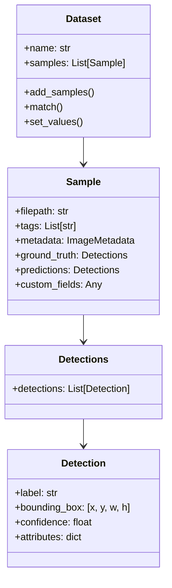

# 📘 คู่มือฉบับสมบูรณ์: FiftyOne (Voxel51) สำหรับวิศวกร Computer Vision & MLOps

> **ที่ตั้งเอกสาร**: `/home/luke/ai_training/PTT_ai_mini/fiftyone_module/fiftyone_complete_guide_th.md`  
> **เป้าหมาย**: รวบรวมฟังก์ชันการทำงาน คำสั่ง รูปแบบการเขียนโค้ด (Syntax) และแนวทางปฏิบัติที่ดีที่สุด (Best Practices) ของ **FiftyOne** ทั้งหมด ตั้งแต่ระดับเริ่มต้นจนถึงระดับ Production ในระบบอุตสาหกรรม

---

## 📑 สารบัญเนื้อหา (Table of Contents)

1. [ภาพรวม FiftyOne และแนวคิด Data-Centric AI](#1-ภาพรวม-fiftyone-และแนวคิด-data-centric-ai)
2. [โครงสร้างข้อมูลหลัก (Core Data Model)](#2-โครงสร้างข้อมูลหลัก-core-data-model)
3. [การจัดการ Dataset (Dataset Operations & I/O)](#3-การจัดการ-dataset-dataset-operations--io)
4. [การสืบค้นและคัดกรองข้อมูล (DatasetView & View Expressions)](#4-การสืบค้นและคัดกรองข้อมูล-datasetview--view-expressions)
5. [FiftyOne Brain: สมองกล AI วิเคราะห์ข้อมูล](#5-fiftyone-brain-สมองกล-ai-วิเคราะห์ข้อมูล)
6. [การประเมินประสิทธิภาพโมเดล (Model Evaluation & Error Analysis)](#6-การประเมินประสิทธิภาพโมเดล-model-evaluation--error-analysis)
7. [การเชื่อมต่อภายนอก (CVAT, Ultralytics YOLO, Label Studio)](#7-การเชื่อมต่อภายนอก-cvat-ultralytics-yolo-label-studio)
8. [FiftyOne App (Web Dashboard & Visualization)](#8-fiftyone-app-web-dashboard--visualization)
9. [เทคนิคระดับ Production ในระบบอุตสาหกรรม (PTT Smart AI Case Study)](#9-เทคนิคระดับ-production-ในระบบอุตสาหกรรม-ptt-smart-ai-case-study)

---

## 1. ภาพรวม FiftyOne และแนวคิด Data-Centric AI

### 1.1 FiftyOne คืออะไร?
**FiftyOne** (พัฒนาโดย Voxel51) เป็นเครื่องมือแบบ Open-Source สำหรับ **Data Curation, Dataset Exploration และ Model Evaluation** ในงาน Computer Vision โดยเฉพาะ

```
[ Model-Centric AI (ยุคเก่า) ]  ➔ โค้ดโมเดลเดิม ข้อมูลเดิม พยายามจูนแต่ Hyperparameters
[ Data-Centric AI (ยุคใหม่) ]   ➔ โมเดลมาตรฐาน (เช่น YOLO) แต่เน้น "คัดกรองคุณภาพข้อมูล" ให้สะอาดและแม่นยำ
```

### 1.2 หน้าที่หลักใน Pipeline
1. **สำรวจข้อมูล (Explore)**: ค้นหาภาพแปลก ภาพเสีย หรือจุดผิดพลาดใน Bounding Box
2. **คัดกรอง (Curate & Filter)**: ตัดภาพซ้ำ (Deduplicate), คัดภาพเบลอ/แสงสะท้อน, เลือกภาพที่หลากหลาย (Diversity Sampling)
3. **ขุดเคสยาก (Hard Sample Mining)**: ดึงภาพที่ AI ทายผิดหรือค่าความมั่นใจต่ำ ส่งต่อไปยัง CVAT
4. **วิเคราะห์ความผิดพลาด (Diagnostics)**: ดู Confusion Matrix, mAP รายคลาส, และเจาะลึก False Negatives

---

## 2. โครงสร้างข้อมูลหลัก (Core Data Model)

FiftyOne ใช้โครงสร้างเชิงวัตถุ (Document-based Schema) คล้าย MongoDB:



### ⚠️ กฎสำคัญเรื่อง Bounding Box ใน FiftyOne:
พิกัด Bounding Box ใน FiftyOne จะเป็น **Normalized Coordinates `[top-left-x, top-left-y, width, height]`** เสมอ (ค่าอยู่ระหว่าง `0.0` ถึง `1.0`) ต่างจาก YOLO ที่เป็น `[center-x, center-y, width, height]`

---

## 3. การจัดการ Dataset (Dataset Operations & I/O)

### 3.1 สร้าง, โหลด และลบ Dataset
```python
import fiftyone as fo

# 1. สร้าง Dataset ใหม่
dataset = fo.Dataset("ptt_factory_inspection")
dataset.persistent = True  # บันทึกถาวรลง Database (ไม่หายเมื่อปิดสคริปต์)

# 2. รายชื่อ Dataset ทั้งหมดในเครื่อง
print(fo.list_datasets())

# 3. โหลด Dataset ที่มีอยู่แล้ว
dataset = fo.load_dataset("ptt_factory_inspection")

# 4. ลบ Dataset
if fo.dataset_exists("old_dataset"):
    fo.delete_dataset("old_dataset")
```

### 3.2 การ Import ข้อมูล (YOLO Format)
```python
import fiftyone as fo

# โหลดชุดข้อมูล YOLO จากโฟลเดอร์ที่มี images/ และ labels/
dataset = fo.Dataset.from_dir(
    dataset_dir="/path/to/dataset/valid",
    dataset_type=fo.types.YOLOv5Dataset,  # รองรับรูปแบบ YOLOv5, v8, v11
    name="ptt_valid_set",
    label_field="ground_truth"
)
```

### 3.3 การสร้าง Sample ทีละรายการและใส่ฟิลด์เอง
```python
sample = fo.Sample(filepath="/path/to/image_01.jpg")

# เพิ่ม Tags
sample.tags.append("indoor")
sample.tags.append("needs_review")

# เพิ่ม Detections แบบ Custom
sample["ground_truth"] = fo.Detections(
    detections=[
        fo.Detection(
            label="handwheel-valve",
            bounding_box=[0.2, 0.3, 0.15, 0.25], # [x, y, w, h] normalized
            confidence=1.0
        )
    ]
)

# เพิ่มฟิลด์ตัวเลขที่คำนวณเอง
sample["blur_score"] = 425.8
sample["glare_ratio"] = 0.02

# บันทึกลง Dataset
dataset.add_sample(sample)
```

### 3.4 การ Export ชุดข้อมูลกลับออกไป
```python
# Export เฉพาะมุมมองที่คัดกรองแล้ว (Clean View) ออกเป็น YOLO format เพื่อนำไปเทรน
clean_view.export(
    export_dir="/path/to/clean_yolo_train",
    dataset_type=fo.types.YOLOv5Dataset,
    label_field="ground_truth",
    classes=DEFAULT_PTT_26_CLASSES
)
```

---

## 4. การสืบค้นและคัดกรองข้อมูล (DatasetView & View Expressions)

หัวใจที่ทรงพลังที่สุดของ FiftyOne คือ **DatasetView** ซึ่งเป็นการกรองข้อมูลแบบ **Non-destructive** (ไม่ทำให้ไฟล์จริงบนดิสก์เสียหาย)

### 4.1 การกรองพื้นฐาน
```python
from fiftyone import ViewField as F

# 1. กรองภาพตาม Tag
reviewed_view = dataset.match_tags("needs_review")

# 2. กรองตามฟิลด์ตัวเลข (เช่น ภาพที่ไม่เบลอ)
sharp_view = dataset.match(F("blur_score") > 120.0)

# 3. จัดเรียงลำดับ (Sort) และจำกัดจำนวน (Limit)
top_sharp = dataset.sort_by("blur_score", reverse=True).limit(50)

# 4. สุ่มตัวอย่างภาพ (Random Sample)
random_sample = dataset.take(100)
```

### 4.2 การกรอง Bounding Box (Label Filtering)
```python
# กรองเฉพาะภาพที่มี "วาล์วมือหมุน" (handwheel-valve)
valve_view = dataset.filter_labels(
    "ground_truth",
    F("label") == "handwheel-valve"
)

# กรองเฉพาะกล่องทำนายที่ Confidence สูงกว่า 0.70
confident_preds = dataset.filter_labels(
    "predictions",
    F("confidence") >= 0.70
)

# กรองเฉพาะวัตถุขนาดเล็ก (พื้นที่กล่อง < 5% ของภาพ)
small_objects_view = dataset.filter_labels(
    "ground_truth",
    (F("bounding_box")[2] * F("bounding_box")[3]) < 0.05
)
```

### 4.3 การบันทึกและแชร์ Saved Views
```python
# บันทึก View ที่กรองไว้เป็นชื่อเรียก เพื่อให้คนอื่นเปิดดูบน Web UI ได้
dataset.save_view("high_quality_valves", valve_view)

# โหลด Saved View มาใช้งาน
saved = dataset.load_saved_view("high_quality_valves")
```

---

## 5. FiftyOne Brain: สมองกล AI วิเคราะห์ข้อมูล

`fiftyone.brain` (fob) คือชุดอัลกอริทึม Machine Learning ขั้นสูงที่ Voxel51 เตรียมไว้ให้ใช้งาน:

### 5.1 คำนวณ Metadata ภาพอัตโนมัติ
```python
# สแกนขนาดภาพ, Aspect ratio, ช่องสี, mime-type
dataset.compute_metadata()
# เข้าถึงผ่าน: sample.metadata.width, sample.metadata.height
```

### 5.2 ตรวจจับภาพซ้ำเป๊ะๆ (Exact Duplicates)
```python
import fiftyone.brain as fob

# ตรวจจับไฟล์ที่ซ้ำกัน 100% ด้วย MD5 Checksum
fob.compute_exact_duplicates(dataset)

# ดึงภาพที่ถูก Tag ว่า "duplicate" ออกมา
duplicates = dataset.match_tags("duplicate")
print(f"พบภาพซ้ำทั้งหมด: {len(duplicates)} ภาพ")
```

### 5.3 เวกเตอร์ความคล้ายคลึง & ภาพคล้าย (Similarity & Near-Duplicates)
```python
# สกัด Image Embeddings ด้วยโมเดล Deep Learning ในตัว
sim_index = fob.compute_similarity(
    dataset,
    model="mobilenet-v2-imagenet-torch",  # หรือ clip-vit-base32-torch
    brain_key="img_sim",
    metric="cosine"
)

# 1. ค้นหาภาพที่คล้ายกับ sample_id ที่กำหนด 10 ภาพ
similar_view = dataset.sort_by_similarity(sample_id, k=10, brain_key="img_sim")

# 2. หาคู่ภาพที่คล้ายกันมาก (Near duplicates เกิน 95%)
# (ช่วยตัดภาพรัวชัตเตอร์ซ้ำมุมเดิมออก)
```

### 5.4 คำนวณความแปลกใหม่ของภาพ (Uniqueness)
```python
# คำนวณคะแนน Uniqueness (0.0 ถึง 1.0) บันทึกลง field "uniqueness"
fob.compute_uniqueness(dataset, brain_key="img_sim")

# ภาพที่แปลก ไม่เหมือนใครในโรงงาน (เหมาะกับการส่งไปเทรน)
unique_view = dataset.sort_by("uniqueness", reverse=True).limit(50)
```

### 5.5 ตรวจจับการ Label ผิด (Label Mistakenness)
```python
# คำนวณว่ากล่องไหนที่คน Label มีโอกาสวาดผิดพลาดสูง โดยเทียบกับโมเดล
fob.compute_mistakenness(
    dataset,
    pred_field="predictions",
    label_field="ground_truth",
    mistakenness_field="mistakenness"
)

# ดึงภาพที่น่าจะ Label ผิดมาตรวจแก้
mistakes_view = dataset.sort_by("mistakenness", reverse=True).limit(100)
```

### 5.6 แผนที่การกระจายตัวของข้อมูล 2 มิติ (UMAP / t-SNE Visualization)
```python
# ลดมิติเวกเตอร์เพื่อนำไปพล็อต Interactive Scatter Plot บน Dashboard
fob.compute_visualization(
    dataset,
    brain_key="img_viz",
    method="umap"  # หรือ "tsne", "pca"
)
```

---

## 6. การประเมินประสิทธิภาพโมเดล (Model Evaluation & Error Analysis)

FiftyOne มี Evaluation Engine ที่คำนวณสถิติระดับมาตรฐาน COCO / OpenImages:

```python
# รันการประเมินเทียบ Predictions กับ Ground Truth
results = dataset.evaluate_detections(
    pred_field="predictions",
    gt_field="ground_truth",
    eval_key="eval_yolo12",
    iou_thresh=0.5,
    compute_mAP=True
)

# 1. แสดงรายงานสรุป mAP, Precision, Recall รวมและรายคลาส
results.print_report()

# 2. ดึง Confusion Matrix
cm = results.confusion_matrix()

# 3. กรองหาเคสพลาดเฉพาะ:
# - False Positives (AI วาดกล่องมั่ว)
fp_view = dataset.filter_labels("predictions", F("eval_yolo12") == "fp")

# - False Negatives (AI มองข้าม ของจริงมีแต่วาดไม่เจอ)
fn_view = dataset.filter_labels("ground_truth", F("eval_yolo12") == "fn")
```

---

## 7. การเชื่อมต่อภายนอก (CVAT, Ultralytics YOLO, Label Studio)

### 7.1 ส่งงานขึ้น CVAT อัตโนมัติ (dataset.annotate)
```python
# ส่งเฉพาะภาพเคสยาก (Hard Samples) พร้อม Pre-annotations ขึ้น CVAT Server
hard_samples_view.annotate(
    anno_key="cvat_batch_ptt_hard_01",
    backend="cvat",
    label_schema={"ground_truth": {"classes": DEFAULT_PTT_26_CLASSES}},
    url="http://cvat-server:8080",
    username="mlops_engineer",
    password="secure_password"
)

# เมื่อคนวาดเสร็จ สามารถโหลดผลลัพธ์จาก CVAT กลับเข้า FiftyOne ได้ด้วย:
# dataset.load_annotations("cvat_batch_ptt_hard_01")
```

### 7.2 ผสานผลการทำนายจาก Ultralytics YOLO
```python
from ultralytics import YOLO

model = YOLO("models/PTT_YOLO12n_Baseline.pt")

for sample in dataset:
    result = model(sample.filepath, conf=0.25, verbose=False)[0]
    h, w = result.orig_shape
    
    detections = []
    for box in result.boxes:
        # แปลง [x1, y1, x2, y2] เป็น FiftyOne Normalized [x, y, w, h]
        x1, y1, x2, y2 = box.xyxy[0].cpu().numpy()
        rel_box = [x1 / w, y1 / h, (x2 - x1) / w, (y2 - y1) / h]
        
        cls_name = model.names[int(box.cls[0].item())]
        conf = float(box.conf[0].item())
        
        detections.append(
            fo.Detection(label=cls_name, bounding_box=rel_box, confidence=conf)
        )
    
    sample["predictions"] = fo.Detections(detections=detections)
    sample.save()
```

---

## 8. FiftyOne App (Web Dashboard & Visualization)

FiftyOne มี UI ในตัวที่ใช้งานผ่าน Web Browser:

```python
import fiftyone as fo

dataset = fo.load_dataset("ptt_factory_inspection")

# เปิด Session บน Web Browser (พอร์ตเริ่มต้น 5151)
session = fo.launch_app(dataset, port=5151, address="0.0.0.0")

# สั่งเปลี่ยน View จากใน Python โค้ด หน้าเว็บจะอัปเดตตามทันที!
session.view = dataset.match(F("blur_score") < 100.0)

# รอไม่ให้สคริปต์ปิดตัวลง
session.wait()
```

---

## 9. เทคนิคระดับ Production ในระบบอุตสาหกรรม (PTT Smart AI Case Study)

ในระบบงานจริงระดับองค์กรของ ปตท. มีแนวทางปฏิบัติสำคัญที่ต้องจำ:

### 💡 1. ปิด Progress Bar ในโหมด Worker / Background Job
หากเรียก FiftyOne ผ่าน Celery Worker หรือ subprocess ต้องปิด progress bar เสมอเพื่อป้องกัน `AttributeError: read-only stream`:
```python
fo.config.show_progress_bars = False
```

### 💡 2. ใช้ `set_values()` แทนการวนลูป `sample.save()` ทีละภาพ
การวนลูป `sample.save()` 10,000 ครั้งจะช้ามาก ให้คำนวณค่าเป็น Python List ทั้งหมด แล้วยิงบันทึกครั้งเดียวด้วย `dataset.set_values("field_name", values)` ซึ่งเร็วกว่า **50-100 เท่า**!

### 💡 3. The Strangler Fig Pattern (FiftyOne-Native Migration)
ในระบบใหญ่ เราไม่จำเป็นต้องสร้าง Database SQL เพิ่มเพื่อเก็บ metadata ภาพซ้ำซ้อน แต่ให้ใช้ **FiftyOne Schema เป็น Single Source of Truth** สำหรับข้อมูลภาพ และใช้ PostgreSQL เก็บเฉพาะ State เชิงธุรกิจ (เช่น สถานะการ Approve งาน)

---

## 🏁 สรุปคำสั่งที่ใช้งานบ่อยที่สุด (Cheat Sheet)

| วัตถุประสงค์ | คำสั่ง FiftyOne |
| :--- | :--- |
| เปิดดู Dataset บนเว็บ | `fo.launch_app(dataset)` |
| ค้นหาภาพซ้ำเป๊ะ | `fob.compute_exact_duplicates(dataset)` |
| คำนวณความคล้าย / ภาพคล้าย | `fob.compute_similarity(dataset, brain_key="sim")` |
| หาภาพที่แปลกที่สุด | `fob.compute_uniqueness(dataset)` |
| ตรวจหา Label ผิดพลาด | `fob.compute_mistakenness(dataset, "predictions", "ground_truth")` |
| กรองค่าตามเงื่อนไข | `dataset.match(F("field_name") > threshold)` |
| กรองตามคลาสวัตถุ | `dataset.filter_labels("ground_truth", F("label") == "valve")` |
| ประเมินผลโมเดล | `dataset.evaluate_detections("predictions", "ground_truth")` |
| ส่งงานขึ้น CVAT | `dataset.annotate("task_name", backend="cvat", ...)` |
